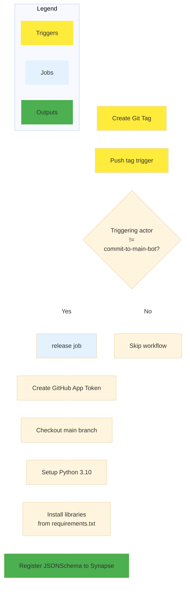

# CI/CD Documentation
## Build Workflow

### Purpose
The `build` workflow is used to test and surface changes made to the data model as updated metadata templates in synapse.

### Triggers
The `build` workflow runs whenever all of the following conditions are met:
* a PR is open and targets the `main` branch
* the PR indludes modifications to the files in the `modules` subdirectory
* the PR is modified by either committing changes to the branch while the PR is open or by closing the PR

### Necessary Actions from Contributors
The `build` workflow is designed to integrate seamlessly into the regular data model maintenance flow. When a PR targeting `main` is open and changes are committed, the changes will be tested through the creation of a google sheet of the appropriate manifest. A comment will be added to the PR discussion with a link to the sheet for inspection.
When the pull request is merged, new excel files will be created for the modified data types and committed to `main`. These excel files will also be uploaded to the specified folder on Synapse.

### Outputs
While a PR is open and under development
* Test templates are created and linked in the PR comments

When a PR is merged
* Modified excel templates are committed to `main`
* All JSONSchema files are generated and committed to `main`
* Modified excel templates are uploaded to synapse

### Sequence Diagram

Mermaid Chart

```mermaid
%%{init: {"flowchart": {"defaultRenderer": "elk"}, "theme": "base", "themeVariables": {"fontSize": "12px", "lineColor": "#ffffff", "edgeLabelBackground": "#ffffff"}}}%%
    flowchart TD
        A[Modify PR] --> B{Action Type}
        B -->|Commit Changes| C[PR synchronize trigger]
        B -->|Close PR| D[PR closed/merged trigger]
        
        C --> E{Triggering actor<br>!=<br>commit-to-main-bot?}
        D --> E
        E -->|Yes| F[schema-convert job]
        E -->|No| Z1[Skip workflow]
        
        F --> F1[Create GitHub App Token]
        F1 --> F2[Checkout code with token]
        F2 --> F3[Setup Python 3.10]
        F3 --> F4[Install libraries<br>from requirements.txt]
        F4 --> F5[List changed files<br>for manifest testing]
        F5 --> F6[Assemble CSV data model]
        F6 --> F7[Commit CSV changes]
        F7 --> F8[Convert CSV to JSON-LD]
        F8 --> F9[Commit JSON-LD changes]
        F9 --> F10[Identify changed manifests]
        F10 --> F11[Save changed manifests to output]
        F11 --> F12[Delay 60 seconds]
        F12 --> G{Is the PR closed?}
        
        G -->|No| H[test job]
        G -->|Yes| G2{Was the PR merged?}
        
        G2 -->|No| Z2[Skip workflow]
        G2 -->|Yes| I[generate-and-upload-manifests job]
        
        H --> H1[Print changed manifests]
        H1 --> H2[Create GitHub App Token]
        H2 --> H3[Checkout code]
        H3 --> H4[Setup Python 3.10]
        H4 --> H5[Install libraries]
        H5 --> H6[Generate test manifests]
        H6 --> H7[Create Test Suite Report with Docker/R]
        H7 --> H8[Report test suite as PR comment]
        H8 --> H9[Upload test artifacts]
        
        I --> I1[Print changed manifests]
        I1 --> I2[Create GitHub App Token]
        I2 --> I3[Checkout main branch]
        I3 --> I4[Setup Python 3.10]
        I4 --> I5[Install libraries]
        I5 --> I6[Generate changed manifests]
        I6 --> I7[Commit manifests to main]
        I7 --> I8[Generate JSONSchema]
        I8 --> I9[Commit schemas to main]
        I9 --> I10[Upload manifests to Synapse]
    subgraph Legend
        direction TB
        triggers[Triggers]
        jobs[Jobs]
        outputs[Outputs]
        triggers ~~~ jobs ~~~ outputs
        style triggers fill:#ffeb3b,stroke-width:0px
        style jobs fill:#e3f2fd,stroke-width:0px
        style outputs fill:#4caf50,stroke-width:0px
    end
    
    style A fill:#ffeb3b
    style C fill:#ffeb3b
    style D fill:#ffeb3b
    style F fill:#e3f2fd
    style H fill:#e3f2fd
    style I fill:#e3f2fd
    style F7 fill:#4caf50
    style F9 fill:#4caf50
    style H9 fill:#4caf50
    style I7 fill:#4caf50
    style I9 fill:#4caf50
    style I10 fill:#4caf50
```

## Release Workflow

### Purpose
The `release` workflow is used to mint JSONSchema files for the data model as part of a release and register them on Synapse so that they may be bound to entities later.

### Triggers
The `release` workflow runs whenever a relase of the data model is minted, that is, when a new version tag is pushed to the repository.

### Necessary Actions from Contributors
Publish a new Release on github and specify a new tag.

### Outputs
* All JSONSchema files are registered with the specified organization on Synapse under the new version tag

### Sequence Diagram

Mermaid Chart

