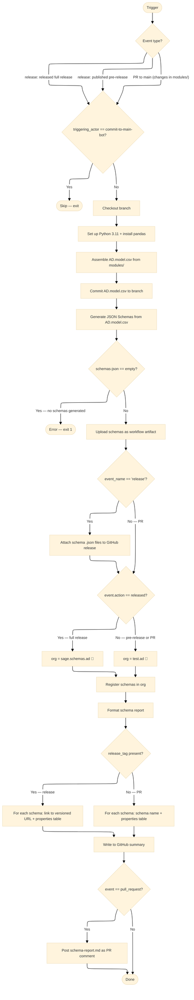

# CI/CD Documentation

## Index

- [Build Workflow](#build-workflow)
- [Register Schema Workflow](#register-schema-workflow)
  - [Triggers](#triggers)
  - [Steps](#steps)
  - [Synapse Organizations](#synapse-organizations)
  - [Versioning](#versioning)
  - [Release Guide](#release-guide)
  - [Required Secrets](#required-secrets)
  - [Outputs](#outputs)
  - [Diagrams](#diagrams-1)

---

## Build Workflow

### Purpose
The `build` workflow is used to test and surface changes made to the data model as updated metadata templates in synapse.

### Triggers
The `build` workflow runs whenever all of the following conditions are met:
* a PR is open and targets the `main` branch
* the PR indludes modifications to the files in the `modules` subdirectory
* the PR is modified by either committing changes to the branch while the PR is open or by closing the PR

### Necessary Actions from Contributors
The `build` workflow is designed to integrate seamlessly into the regular data model maintenance flow. When a PR targeting `main` is open and changes are committed, the changes will be tested through the creation of a google sheet of the appropriate manifest. A comment will be added to the PR discussion with a link to the sheet for inspection.
When the pull request is merged, new excel files will be created for the modified data types and committed to `main`. These excel files will also be uploaded to the specified folder on Synapse.

### Outputs
While a PR is open and under development
* Test templates are created and linked in the PR comments

When a PR is labeled as `automerge`
* The Pull request is merged by a bot
* Modified excel templates are committed to `main`
* All JSONSchema files are generated and committed to `main`
* Modified excel templates are uploaded to synapse

### Diagrams

Mermaid diagram for build workflow

```mermaid
%%{init: {"flowchart": {"defaultRenderer": "elk"}, "theme": "base", "themeVariables": {"fontSize": "12px", "lineColor": "#000000", "edgeLabelBackground": "#ffffff"}}}%%
    flowchart TD
        A[Create/Update PR] --> B{PR Action Type}
        B -->|opened/synchronize| C[PR trigger - paths: modules/**]
        B -->|labeled| D[PR labeled trigger]
        
        C --> E{Triggering actor<br>!=<br>commit-to-main-bot?}
        D --> E
        E -->|Yes| F([schema-convert job])
        E -->|No| Z1[Skip workflow]
        
        F --> F1[Create GitHub App Token]
        F1 --> F2[Checkout PR branch with token]
        F2 --> F3[Setup Python 3.10]
        F3 --> F4[Install libraries<br>from requirements.txt]
        F4 --> F5[List changed files<br>for manifest testing]
        F5 --> F6[Assemble CSV data model]
        F6 --> F7[Commit CSV changes]
        F7 --> F8[Convert CSV to JSON-LD]
        F8 --> F9[Commit JSON-LD changes]
        F9 --> F10[Identify changed manifests]
        F10 --> F11[Save changed manifests to output]
        F11 --> F12[Delay 60 seconds]
        
        F12 --> G{Action != labeled?}
        F12 --> H{Has automerge label?}
        
        G --->|Yes| I([test job])
        H -->|Yes| H2{GitHub event != opened<br>and<br>GitHub event != synchronize?}
        
        H2 -->|Yes| J([merge job])
        H2 -->|No| Z2[Skip workflow]
        
        I --> I1[Print changed manifests]
        I1 --> I2[Create GitHub App Token]
        I2 --> I3[Checkout PR branch]
        I3 --> I4[Setup Python 3.10]
        I4 --> I5[Install libraries]
        I5 --> I6[Generate test manifests]
        I6 --> I7[Create Test Suite Report with Docker/R]
        I7 --> I8[Report test suite as PR comment]
        I8 --> I9[Upload test artifacts]
        
        J --> J1[Create GitHub App Token]
        J1 --> J2[Squash and merge PR]
        J2 --> J3[Delete development branch]
        
        J3 --> K([generate-and-upload-manifests job])
        
        K --> K1[Print changed manifests]
        K1 --> K2[Create GitHub App Token]
        K2 --> K3[Checkout main branch]
        K3 --> K4[Setup Python 3.10]
        K4 --> K5[Install libraries]
        K5 --> K6[Generate changed manifests]
        K6 --> K7[Commit manifests to main]
        K7 --> K8[Generate JSONSchema]
        K8 --> K9[Commit schemas to main]
        K9 --> K10[Upload manifests to Synapse]
        
    subgraph Legend
        direction TB
        triggers[Triggers]
        jobs([Jobs])
        outputs[Outputs]
        triggers ~~~ jobs ~~~ outputs
        style triggers fill:#ffeb3b,stroke-width:0px
        style jobs fill:#e3f2fd,stroke-width:0px
        style outputs fill:#4caf50,stroke-width:0px
    end
    
    linkStyle default stroke: gray
    style A fill:#ffeb3b
    style C fill:#ffeb3b
    style D fill:#ffeb3b
    style F fill:#e3f2fd
    style I fill:#e3f2fd
    style J fill:#e3f2fd
    style K fill:#e3f2fd
    style F7 fill:#4caf50
    style F9 fill:#4caf50
    style I8 fill:#4caf50
    style I9 fill:#4caf50
    style J2 fill:#4caf50
    style K7 fill:#4caf50
    style K9 fill:#4caf50
    style K10 fill:#4caf50
```

## Register Schema Workflow

### Purpose
The `register-schema` workflow generates JSON schemas from the AD data model CSV, registers them in a Synapse organization, and posts a markdown summary report as a PR comment or workflow summary.

This workflow handles schema registration across two Synapse organizations:
- **Test org** (`test.ad`): used during active development and pre-release validation
- **Production org** (`sage.schemas.ad`): used for official versioned releases

### Triggers
| Event | Condition | Target Org |
|-------|-----------|------------|
| Pull request opened, synchronized, or labeled | Targets `main`; changes in `modules/**` | `test.ad` |
| Release published (pre-release) | `release.published` | `test.ad` |
| Release released (full release or pre-release promoted) | `release.released` | `sage.schemas.ad` |

> **Note:** The workflow is skipped if triggered by `commit-to-main-bot-adkp[bot]`.

### Steps
1. **Checkout** — checks out the PR branch (`head_ref` for pull requests, default ref for releases)
2. **Set up Python 3.11** — installs Python and the `pandas` dependency
3. **Assemble CSV data model** — runs `assemble_csv_data_model.py` to join all `modules/` files into `AD.model.csv`
4. **Commit CSV changes** — commits the updated `AD.model.csv` back to the branch via [`add-and-commit`](https://github.com/EndBug/add-and-commit)
5. **Generate JSON Schemas** — converts `AD.model.csv` into JSON schema files using [`generate-jsonschema`](https://github.com/Sage-Bionetworks-Actions/generate-jsonschema)
6. **Check schemas were generated** — exits with an error if no schemas were produced
7. **Upload schemas as artifacts** — saves generated `.json` schemas as a downloadable workflow artifact
8. **Create release assets** — attaches the schema `.json` files to the GitHub release page (all release events: `release.published` and `release.released`)
9. **Resolve schema organization** — selects `test.ad` or `sage.schemas.ad` based on the trigger event action
10. **Register schemas in Synapse** — registers schemas in the resolved org via [`register-jsonschema`](https://github.com/Sage-Bionetworks-Actions/register-jsonschema); uses the release tag as the semantic version when available
11. **Format Schema Report** — builds a markdown summary listing all generated schemas and their properties; includes Synapse links when a release tag is present
12. **Comment PR with Schema Summary** — posts the report as a PR comment (pull request events only); also writes the report to the workflow run summary

### Synapse Organizations
| Org Name | Purpose |
|----------|---------|
| `test.ad` | Staging: used for PR previews and pre-release validation |
| `sage.schemas.ad` | Production: used for official versioned releases |

### Versioning

| Trigger | Semantic Version |
|---------|-----------------|
| Pull request | None (auto-assigned by Synapse) |
| Pre-release published | Release tag (e.g. `1.1.0`) |
| Release released | Release tag (e.g. `1.1.0`) |

When a PR triggers registration, no semantic version is provided. Synapse assigns each registered schema an internal `version_id`, so **schemas from different PRs do not overwrite each other** — each registration produces a distinct entry in the schema registry.

### Release Guide

The recommended release process uses a two-step GitHub release flow to validate schemas in the test org before promoting to production.

#### Step 1 — Publish a Pre-release (registers to `test.ad`)
1. Go to **Releases → Draft a new release** in GitHub.
2. Create a new tag (e.g., `v1.2.0`) targeting `main`.
3. Check **"Set as a pre-release"**.
4. Click **Publish release** — this triggers `release.published` and registers schemas to `test.ad`.
5. Inspect the workflow summary or PR comment for the schema report.
6. Verify schemas appear in `test.ad` on Synapse.

#### Step 2 — Promote to Full Release (registers to `sage.schemas.ad`)
1. Once validated, return to the pre-release on GitHub.
2. Edit the release and uncheck **"Set as a pre-release"** (or click **"Promote to full release"**).
3. Click **Update release** — this triggers `release.released` and registers schemas to `sage.schemas.ad`.
4. Verify schemas appear in `sage.schemas.ad` on Synapse with the correct semantic version.

> **Note:**
> - Only the `release.released` action writes to the production org. Accidental pre-release publishes will only affect `test.ad`.
> - Editing the existing pre-release (not creating a new tag) is what triggers the `released` event and routes schemas to production. This triggers the workflow again and registers schemas to the production org.
> - Do not create a new tag for promotion — editing the existing pre-release is sufficient.
>
> **Release tag format requirements (enforced by Synapse):**
> - Format: `X.Y.Z` — digits only (e.g. `1.2.0` or `v1.2.0`)
> - Must be greater than `0.0.0`
> - No pre-release suffixes — tags like `v1.0.0-rc1`, `v1.0.0-beta`, or `v1.0.0-alpha` will cause schema registration to fail

### Required Secrets
| Secret | Description |
|--------|-------------|
| `SYNAPSE_TOKEN_DPE` | Synapse Personal Access Token with permissions to register schemas in both orgs |

### Outputs
- JSON schema artifacts uploaded per workflow run
- Schemas registered in the resolved Synapse organization (versioned when triggered by a release)
- Markdown summary report posted as a PR comment (PR events) and written to the workflow run summary (all events)

### Diagrams

Mermaid diagram for register-schema workflow

```mermaid
%%{init: {"flowchart": {"defaultRenderer": "elk"}, "theme": "base", "themeVariables": {"fontSize": "12px", "lineColor": "#000000", "edgeLabelBackground": "#ffffff"}}}%%
flowchart TD
    A(["Trigger"]) --> B{"Event type?"}
    B -- "PR to main (changes in modules/)" --> C{"triggering_actor == commit-to-main-bot?"}
    B -- "release: published pre-release" --> C
    B -- "release: released full release" --> C
    C -- Yes --> SKIP(["Skip — exit"])
    C -- No --> D["Checkout branch"]
    D --> D1["Set up Python 3.11 + install pandas"]
    D1 --> D2["Assemble AD.model.csv from modules/"]
    D2 --> D3["Commit AD.model.csv to branch"]
    D3 --> E["Generate JSON Schemas from AD.model.csv"]
    E --> F{"schemas-json == empty?"}
    F -- Yes — no schemas generated --> FAIL(["Error — exit 1"])
    F -- No --> H["Upload schemas as workflow artifact"]
    H --> RA{"event_name == 'release'?"}
    RA -- Yes --> I2["Attach schema .json files to GitHub release"]
    RA -- No — PR --> I
    I2 --> I{"event.action == released?"}
    I -- Yes — full release --> J["org = sage.schemas.ad 🚀"]
    I -- "No — pre-release or PR" --> K["org = test.ad 🧪"]
    J --> L["Register schemas in org"]
    K --> L
    L --> M["Format schema report"]
    M --> N{"release_tag present?"}
    N -- Yes — release --> O["For each schema: link to versioned URL + properties table"]
    N -- No — PR --> P["For each schema: schema name + properties table"]
    O --> Q["Write to GitHub summary"]
    P --> Q
    Q --> R{"event == pull_request?"}
    R -- Yes --> S["Post schema-report.md as PR comment"]
    R -- No --> T(["Done"])
    S --> T
```

